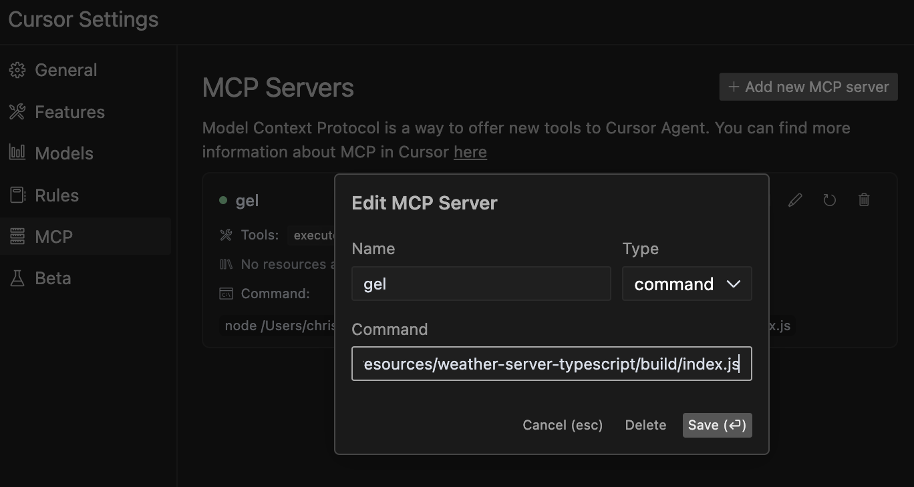

# Gel Database MCP Server 

A TypeScript-based Model Context Protocol (MCP) server designed to streamline Gel database operations with EdgeQL queries. This project provides Tools for LLM Agents (Cursor Agent, Claude Code, etc) to automate learning about your schema, and writing, validating, and executing database queries. Easily interact with your Gel database through natural language. Vibe coders rejoice! 


Note: Query generation is not included since LLMs can write more flexible queries. Tested this with Cursor agent using Claude-3.7-sonnet-thinking and had good results after providing Gel docs by linking the relevant webpages. 


## Quick Start Guide

```bash
# 1. Install dependencies
yarn install

# 2. Copy your dbschema folder into the project if you have one already 
# cp -r /path/to/your/dbschema ./
# or just copy and paste

# 3. Initialize a Gel project
npx gel project init
# Follow prompts to set up a new project 
# Can point to an existing gel instance by providing the name of your instance
#   -Import migrations if it asks

# 4. Generate EdgeQL JavaScript query builder files
npx @gel/generate edgeql-js
# Note: Re-run this command after any schema changes

# 5. Update connection settings
# Edit src/index_gel.ts lines 19-25 with your database, host, port, user, password
# Edit src/index_gel.ts line 37 with your branch name

# 6. Build the project
yarn build

# 7. (optional) Test the server runs without errors
node build/index.js

# 7.1 (if you have errors) Test server with a UI that provides more clear error logs using: 
npx @modelcontextprotocol/inspector node build/index.js

# 8. (Recommended) Include the gel_llm.txt documentation file
# Download the Gel documentation file and place it in your project root
# This allows both the search tool and direct file access for your LLM agent
# curl -o gel_llm.txt https://raw.githubusercontent.com/yourorg/gel-docs/main/gel_llm.txt
# Note: Replace the URL with the actual source of your gel_llm.txt file
```
# Connect MCP Server in Cursor
1. Click on the gear icon on the top right > MCP > +Add a new server
2. Name it whatever you want
3. Select type: Command
4. Enter this: node your/full/path/to/build/index.js



**Note:** While this server has been primarily tested with Cursor's agent, it should work with other agents and LLMs that support the Model Context Protocol. If you test with other agents, please feel free to contribute your findings!


## Available Tools

The Gel Database MCP Server provides the following tools:

### describe-schema
This helps your LLM agent learn and understand your database structure without having to manually inspect the code. The agent can discover available entity types, their properties, relationships, and constraints to generate more accurate queries.

**When to use:** When your agent needs to understand the structure of a database entity before querying it.


### validate-query
This helps your LLM agent verify raw EdgeQL query syntax without executing it, allowing safe validation of generated queries before they're run against your database.

**When to use:** During query development to check syntax without risking execution side effects.


### execute-edgeql
This helps your LLM agent directly interact with your database by running raw EdgeQL queries, retrieving data, and performing operations based on your instructions. Your LLM can generate EdgeQL queries and execute them autonomously.

**Example:**
```edgeql
SELECT Product { name, price } FILTER .price > 100;
```


### search-gel-docs
This tool allows your LLM agent to search through the Gel documentation to find relevant information about EdgeQL syntax, features, or examples. It returns comprehensive results with context to help the agent better understand Gel database concepts.

**When to use:** When your agent needs to learn about specific Gel/EdgeQL features, understand syntax, or find examples for implementing database operations.

**Example:**
```
search_term: "for loop"
context_lines: 10  # Optional: Number of context lines to show (default: 5)
match_all_terms: true  # Optional: Require all terms to match (default: false)
```

**Note on Documentation Hybrid Approach:** For optimal results, we recommend both:
1. Including the `gel_llm.txt` file in your project root (for direct file access)
2. Using the search-gel-docs tool for targeted queries

This hybrid approach gives your LLM agent the flexibility to search for specific terms while also accessing the complete documentation when needed for broader context.

### execute-typescript
Similar to execute-edgeql but can use this for testing and running Typescript Gel queries made with the query builder syntax. 

Instructions are included in the tool, but still a good idea to ask the agent what instructions it has so it loads them up in context. This makes sure it doesn't skip them. 

Note: General JavaScript syntax errors can crash the server, so if the connection is appearing as closed you will have to refresh the crashed server in Cursor MCP settings or restart the server. 

**Tell the LLM these are the Best practices:**
- Use `await gelClient.query()` with console.log to display results
- Use ORDER BY with THEN, not commas (e.g., ORDER BY .field1 THEN .field2)
- Keep code simple and focused on a single operation

**Example:**
```typescript
console.log(await gelClient.query(`
  SELECT Product { 
    name, 
    price 
  } 
  FILTER .price > 100 
  ORDER BY .price DESC 
  LIMIT 5;
`));
```

**When to use:** For complex queries that require programmatic logic or when you need to process query results with JavaScript.


## Learn More

For more information about the Model Context Protocol, visit [modelcontextprotocol.io/quickstart](https://modelcontextprotocol.io/quickstart).
